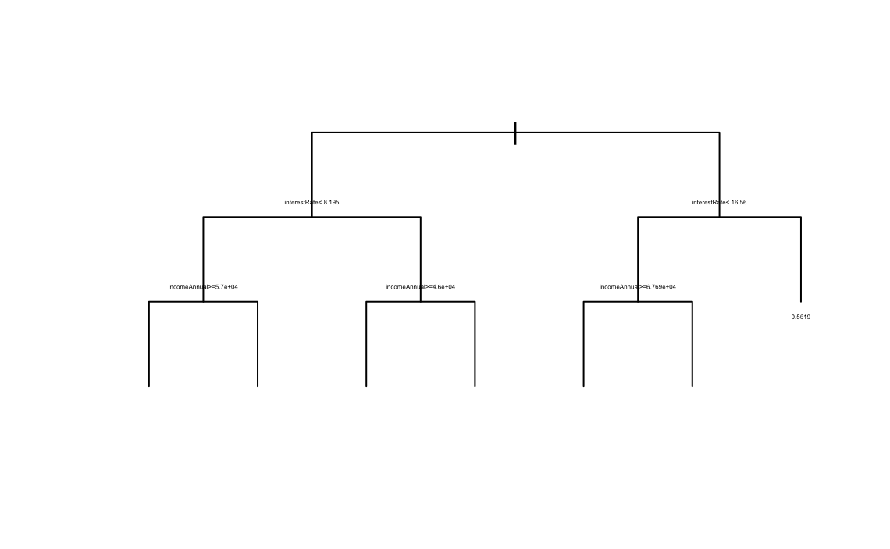
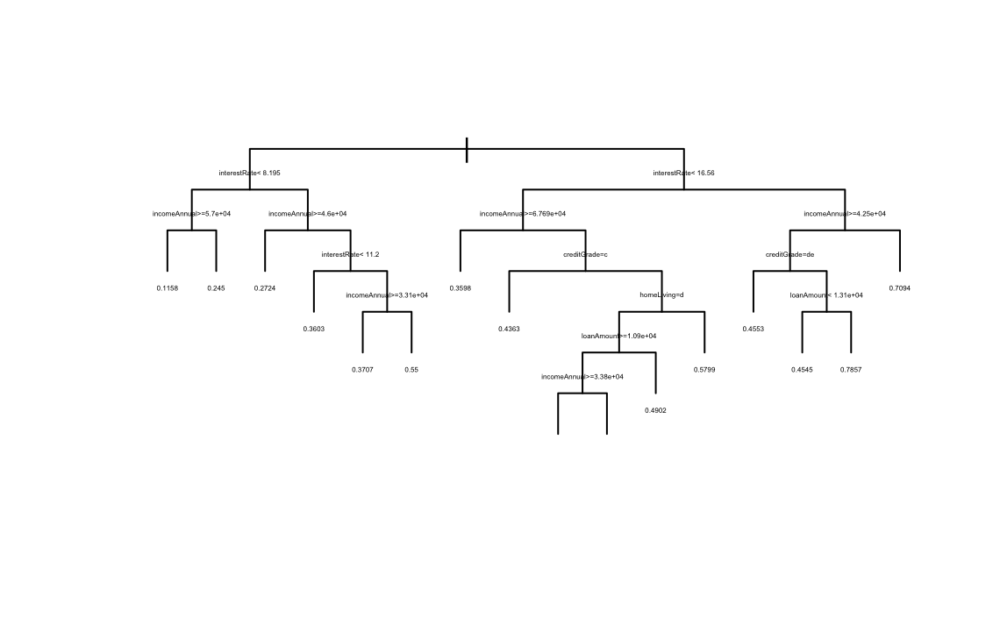

# Loan Default Prediction via Decision Trees



## Project Overview
This project explores loan default prediction using decision tree classification models in R. The analysis focuses on identifying borrower and loan characteristics associated with default risk while building interpretable classification models for predictive analysis.

The project includes:
- exploratory data analysis (EDA)
- feature evaluation
- decision tree modeling
- tree pruning
- model simplification
- classification analysis

---

# Project Objectives
- Analyze borrower financial characteristics
- Identify variables associated with loan default risk
- Build interpretable decision tree classification models
- Compare full and pruned decision tree structures
- Evaluate model simplicity versus predictive performance

---

# Tools & Technologies
- R
- rpart
- rpart.plot
- tidyverse
- ggplot2
- caret
- Decision Trees
- Classification Modeling

---

# Repository Structure

```text
Loan_Default_Decision_Tree/
│
├── Data/
├── Images/
│   ├── Decision-Tree.png
│   └── Decision-Tree-1.png
│
├── Notebooks/
├── Reports/
└── README.md
```

---

# Key Variables Analyzed
- Interest Rate
- Annual Income
- Credit Grade
- Loan Amount
- Home Ownership
- Employment Years
- Loan Default Indicator

---

# Exploratory Analysis

The project explored relationships between:
- borrower income
- loan characteristics
- credit grade
- interest rate
- default behavior

The analysis focused on identifying the variables most associated with elevated default risk.

---

# Decision Tree Modeling

Two decision tree models were developed:
1. Full decision tree model
2. Simplified/pruned decision tree model

The models were designed to classify borrower default outcomes while maintaining interpretability for business analysis and risk evaluation.

---

# Full Decision Tree

The full decision tree includes multiple borrower and financial characteristics to create detailed classification splits.

Key split variables included:
- interest rate
- annual income
- credit grade
- loan amount
- home ownership



---

# Pruned Decision Tree

The simplified decision tree reduces model complexity while preserving the most important predictive relationships.

The pruned model improves interpretability and reduces overfitting risk.


---

# Key Findings
- Interest rate was one of the strongest predictors of loan default risk.
- Annual income significantly influenced borrower classification outcomes.
- Credit grade contributed meaningful separation between lower-risk and higher-risk borrowers.
- Simpler tree structures improved interpretability while maintaining useful predictive performance.
- Decision trees provided clear rule-based segmentation for loan risk evaluation.

---

# Model Evaluation

The project evaluated:
- tree complexity
- interpretability
- predictive segmentation
- split importance
- classification structure

The comparison between full and pruned trees highlighted the tradeoff between:
- model complexity
- interpretability
- overfitting risk

---

# Supporting Files

This repository includes:
- R notebooks
- decision tree visualizations
- classification outputs
- model summaries
- analytical reports

---

# Skills Demonstrated
- Decision tree modeling
- Classification analysis
- Predictive analytics
- Model pruning
- Exploratory data analysis
- Statistical analysis
- R programming
- Data visualization
- Risk modeling

---

# Data

This project uses borrower financial and loan performance data to evaluate default prediction through classification modeling.

The dataset includes:
- borrower demographics
- financial characteristics
- loan information
- credit-related variables
- loan default outcomes

The data was used to build interpretable predictive decision tree models.

---

# Author

Cameron Batts

GitHub: https://github.com/Cameron-Batts

Portfolio: https://cameron-batts.github.io

